# Lab 1 — Active Directory on Azure

> **Portfolio goal:** Build, secure, troubleshoot, and verify a working Active Directory environment in Azure, then document the environment as a reusable infrastructure project rather than a one-off exercise.

I built a Windows Server 2025 Active Directory domain in Azure around `lab.local`, created department OUs and security groups, enforced machine policy with Group Policy, applied a Fine-Grained Password Policy to the IT administrators group, domain-joined a second server for validation, and completed common help desk identity tasks with PowerShell.

The most valuable part of the project was not simply getting Active Directory running. It was learning where different policy types actually belong, proving that the policies reached the intended users and computers, and correcting several assumptions in the source lab when the real environment behaved differently.

🎥 **Walkthrough video:** _Coming after final repository review._

## Project snapshot

| | |
|---|---|
| **Platform** | Microsoft Azure — East US 2 |
| **Domain controller** | `DC01` — Standard_D2s_v3, 2 vCPU / 8 GiB |
| **Operating system** | Windows Server 2025 Datacenter |
| **Domain** | `lab.local` — single forest / single domain |
| **DC private IP** | `10.0.1.4` |
| **Validation server** | `WS01` — `10.0.1.5`, no public IP |
| **Network** | `lab-vnet` `10.0.0.0/16` → `lab-subnet` `10.0.1.0/24` |
| **Core tools** | Azure Portal, Server Manager, ADUC, GPMC, ADAC, PowerShell, VS Code |
| **Automation** | 7 PowerShell scripts |
| **Build time** | Completed across multiple lab sessions |
| **Cost controls** | Auto-shutdown configured; VMs stopped/deallocated between work sessions |

## Skills demonstrated

- Azure virtual machine and VNet administration
- Active Directory Domain Services and DNS
- Domain controller deployment and verification
- Organizational Units and group-based access design
- Group Policy creation, linking, and validation
- Fine-Grained Password Policies
- Domain account lockout policy
- Windows domain join and DNS troubleshooting
- PowerShell administration and verification
- Password reset, account unlock, offboarding, and account auditing
- RDP exposure reduction and jump-box-style administration
- Technical documentation and evidence collection

---

## Why this matters for cloud roles

Identity, DNS, access control, and policy scoping do not disappear when infrastructure moves to the cloud. Many organizations still operate Active Directory alongside Microsoft Entra ID, and the same core ideas carry over: authenticate identities centrally, grant access through groups, scope policy deliberately, and verify the effective result instead of assuming configuration equals enforcement.

This lab gave me hands-on practice with those concepts at the Windows domain layer before applying the same thinking to cloud identity and Azure administration.

| This lab | Cloud / hybrid concept |
|---|---|
| AD DS authenticates domain identities | Microsoft Entra ID authenticates cloud identities |
| Security groups control access by membership | Entra groups and Azure RBAC use group-based authorization |
| GPO scopes settings to computers in an OU | Intune/configuration policies scope settings to managed devices and groups |
| Centralized disable/offboarding closes access | Centralized identity lifecycle management disables access across connected resources |

---

## Architecture

### Azure network and access path

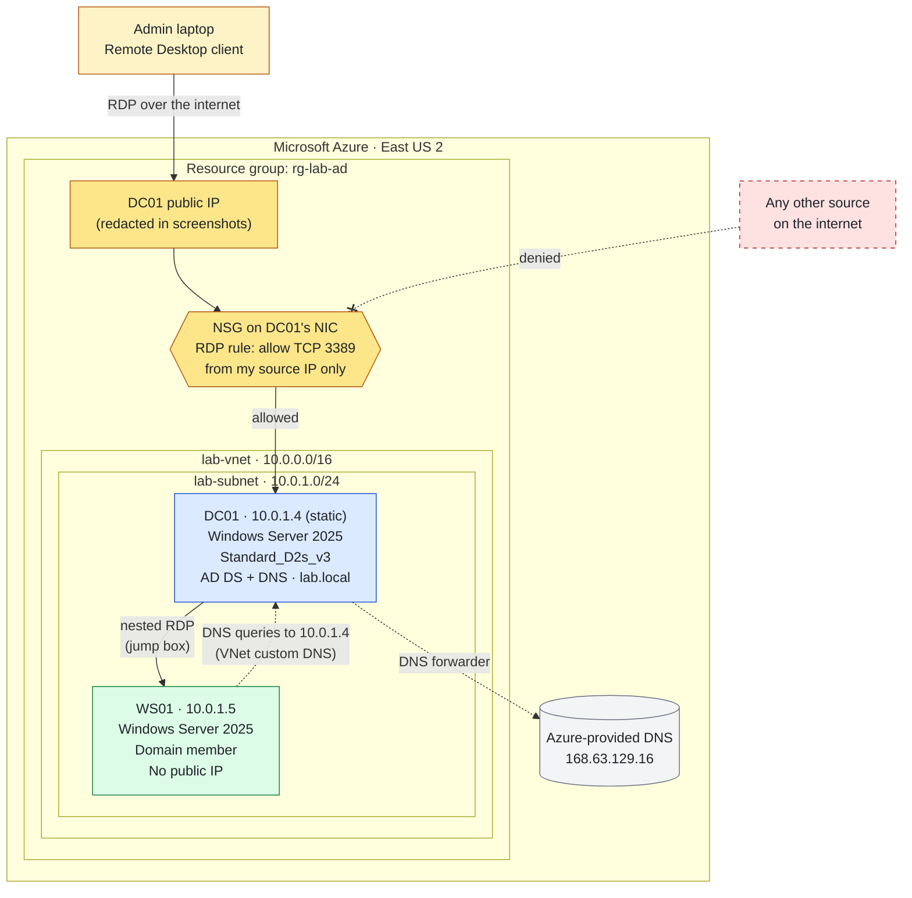
```mermaid
flowchart TB
    ADMIN["Admin laptop<br/>Remote Desktop client"]
    OTHER["Any other source<br/>on the internet"]

    subgraph AZURE["Microsoft Azure · East US 2"]
        subgraph RG["Resource group: rg-lab-ad"]
            PIP["DC01 public IP<br/>(redacted in screenshots)"]
            NSG{{"NSG on DC01's NIC<br/>RDP rule: allow TCP 3389<br/>from my source IP only"}}
            subgraph VNET["lab-vnet · 10.0.0.0/16"]
                subgraph SUBNET["lab-subnet · 10.0.1.0/24"]
                    DC01["DC01 · 10.0.1.4 (static)<br/>Windows Server 2025<br/>Standard_D2s_v3<br/>AD DS + DNS · lab.local"]
                    WS01["WS01 · 10.0.1.5<br/>Windows Server 2025<br/>Domain member<br/>No public IP"]
                end
            end
        end
        AZDNS[("Azure-provided DNS<br/>168.63.129.16")]
    end

    ADMIN -->|"RDP over the internet"| PIP
    PIP --> NSG
    OTHER -. "denied" .-x NSG
    NSG -->|"allowed"| DC01
    DC01 -->|"nested RDP<br/>(jump box)"| WS01
    WS01 -.->|"DNS queries to 10.0.1.4<br/>(VNet custom DNS)"| DC01
    DC01 -.->|"DNS forwarder"| AZDNS

    classDef client fill:#fef3c7,stroke:#b45309,color:#1f2328
    classDef exposed fill:#fde68a,stroke:#b45309,color:#1f2328
    classDef dc fill:#dbeafe,stroke:#1d4ed8,color:#1f2328
    classDef member fill:#dcfce7,stroke:#15803d,color:#1f2328
    classDef blocked fill:#fee2e2,stroke:#b91c1c,color:#1f2328,stroke-dasharray:5 5
    classDef platform fill:#f3f4f6,stroke:#6b7280,color:#1f2328

    class ADMIN client
    class PIP,NSG exposed
    class DC01 dc
    class WS01 member
    class OTHER blocked
    class AZDNS platform
```

### Environment layout

```text
Microsoft Azure
│
└── Resource group: rg-lab-ad
    │
    └── lab-vnet 10.0.0.0/16
        │
        └── lab-subnet 10.0.1.0/24
            │
            ├── DC01  10.0.1.4
            │   ├── Windows Server 2025 Datacenter
            │   ├── Active Directory Domain Services
            │   ├── DNS
            │   ├── Forest/domain: lab.local
            │   │
            │   ├── OU=IT
            │   │   ├── IT_Admins
            │   │   └── alice.chen
            │   ├── OU=Finance
            │   │   ├── Finance_Users
            │   │   └── bob.patel
            │   ├── OU=HR
            │   │   ├── HR_Users
            │   │   └── carol.jones
            │   ├── OU=Sales
            │   │   ├── Sales_Users
            │   │   └── david.smith
            │   └── OU=Workstations
            │
            │   GPO: IT Security Policy
            │   ├── Machine inactivity limit: 900 seconds
            │   └── Removable storage: deny all access
            │
            │   PSO: IT-Admins-PSO
            │   ├── Minimum password length: 12
            │   ├── Complexity enabled
            │   └── Password history: 24
            │
            │   Default Domain Policy
            │   └── Account lockout: 5 attempts / 15 minutes
            │
            └── WS01  10.0.1.5
                ├── Windows Server 2025 acting as the validation workstation
                ├── No public IP
                ├── Domain joined to lab.local
                └── Computer object moved to OU=IT for GPO testing
```

I deliberately kept WS01 off the public internet. I administered it by opening an RDP session from DC01 to WS01, so the lab used one internet-facing administrative entry point instead of exposing both systems.

### Where each policy takes effect

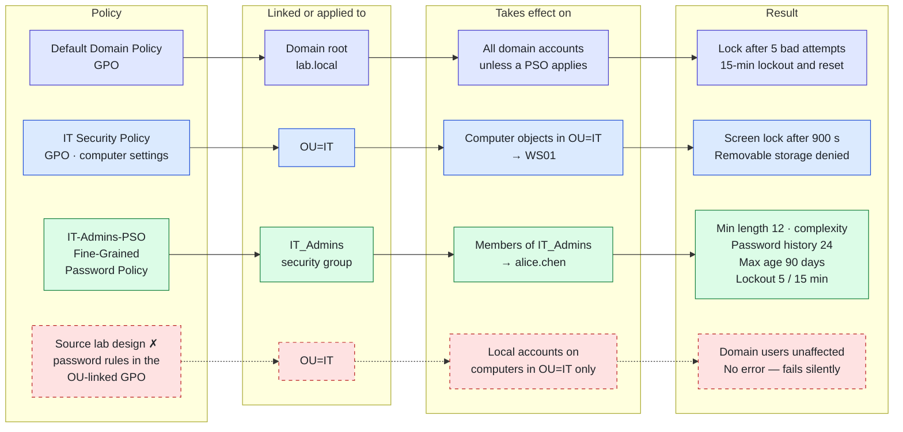
```mermaid
flowchart LR
    subgraph POL["Policy"]
        P1["Default Domain Policy<br/>GPO"]
        P2["IT Security Policy<br/>GPO · computer settings"]
        P3["IT-Admins-PSO<br/>Fine-Grained<br/>Password Policy"]
        P4["Source lab design ✗<br/>password rules in the<br/>OU-linked GPO"]
    end
    subgraph SCOPE["Linked or applied to"]
        S1["Domain root<br/>lab.local"]
        S2["OU=IT"]
        S3["IT_Admins<br/>security group"]
        S4["OU=IT"]
    end
    subgraph REACH["Takes effect on"]
        T1["All domain accounts<br/>unless a PSO applies"]
        T2["Computer objects in OU=IT<br/>→ WS01"]
        T3["Members of IT_Admins<br/>→ alice.chen"]
        T4["Local accounts on<br/>computers in OU=IT only"]
    end
    subgraph ENF["Result"]
        E1["Lock after 5 bad attempts<br/>15-min lockout and reset"]
        E2["Screen lock after 900 s<br/>Removable storage denied"]
        E3["Min length 12 · complexity<br/>Password history 24<br/>Max age 90 days<br/>Lockout 5 / 15 min"]
        E4["Domain users unaffected<br/>No error — fails silently"]
    end

    P1 --> S1 --> T1 --> E1
    P2 --> S2 --> T2 --> E2
    P3 --> S3 --> T3 --> E3
    P4 -.-> S4 -.-> T4 -.-> E4

    classDef domainpol fill:#e0e7ff,stroke:#4338ca,color:#1f2328
    classDef gpo fill:#dbeafe,stroke:#1d4ed8,color:#1f2328
    classDef pso fill:#dcfce7,stroke:#15803d,color:#1f2328
    classDef wrong fill:#fee2e2,stroke:#b91c1c,color:#1f2328,stroke-dasharray:5 5

    class P1,S1,T1,E1 domainpol
    class P2,S2,T2,E2 gpo
    class P3,S3,T3,E3 pso
    class P4,S4,T4,E4 wrong
```

The dashed red row is the source lab's original design. It raises no error, but it never touches domain accounts like `alice.chen`.

### How WS01 joined the domain and received policy

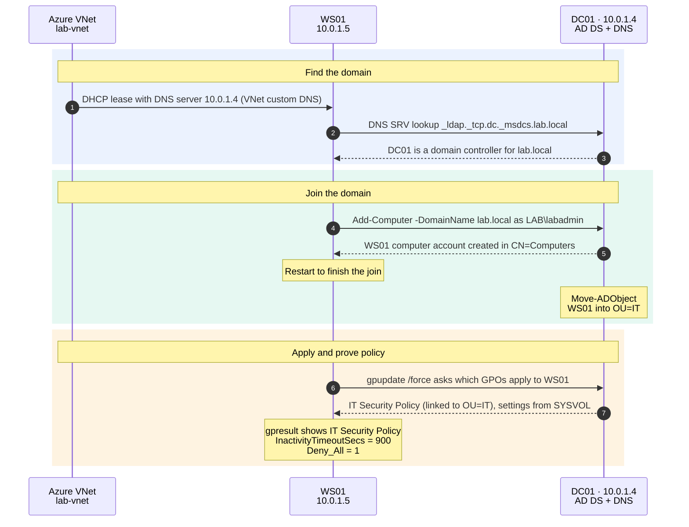
```mermaid
sequenceDiagram
    autonumber
    participant AZ as Azure VNet<br/>lab-vnet
    participant WS as WS01<br/>10.0.1.5
    participant DC as DC01 · 10.0.1.4<br/>AD DS + DNS

    rect rgba(59, 130, 246, 0.10)
    Note over AZ,DC: Find the domain
    AZ->>WS: DHCP lease with DNS server 10.0.1.4 (VNet custom DNS)
    WS->>DC: DNS SRV lookup _ldap._tcp.dc._msdcs.lab.local
    DC-->>WS: DC01 is a domain controller for lab.local
    end

    rect rgba(16, 185, 129, 0.10)
    Note over AZ,DC: Join the domain
    WS->>DC: Add-Computer -DomainName lab.local as LAB\labadmin
    DC-->>WS: WS01 computer account created in CN=Computers
    Note over WS: Restart to finish the join
    Note over DC: Move-ADObject<br/>WS01 into OU=IT
    end

    rect rgba(245, 158, 11, 0.12)
    Note over AZ,DC: Apply and prove policy
    WS->>DC: gpupdate /force asks which GPOs apply to WS01
    DC-->>WS: IT Security Policy (linked to OU=IT), settings from SYSVOL
    Note over WS: gpresult shows IT Security Policy<br/>InactivityTimeoutSecs = 900<br/>Deny_All = 1
    end
```

---

## What I built

### 1. Provisioned and secured DC01

I deployed `DC01` in Azure in the `rg-lab-ad` resource group using Windows Server 2025 Datacenter. The VM runs in East US 2 on `lab-vnet/lab-subnet`, and its private address is `10.0.1.4`. I pinned that private IP as **Static** on DC01's Azure network interface instead of hard-coding it inside Windows. A domain controller needs an address that never changes, and on Azure the platform, not the guest OS, owns IP assignment.

I restricted TCP/3389 in the Network Security Group to my current source IP instead of leaving RDP open to the internet. I also kept the public IP and subscription information out of the repository screenshots.

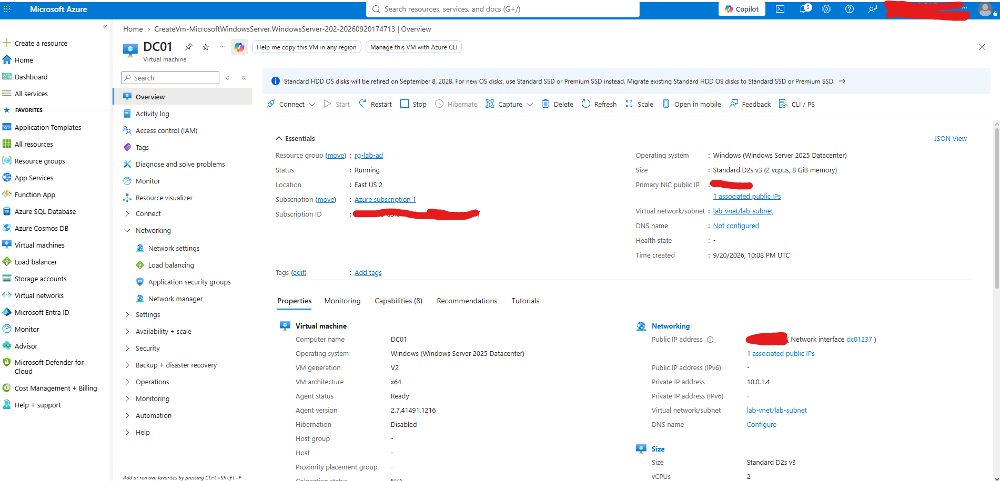

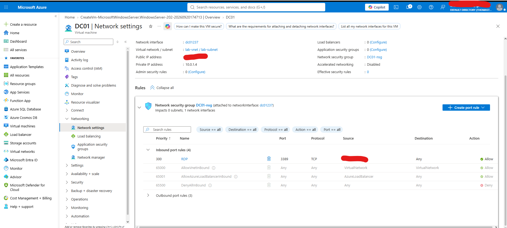

### 2. Installed AD DS and promoted the domain controller

I installed Active Directory Domain Services and the Group Policy management tools first. Installing the role only adds the Windows components; promotion is what actually creates the forest, domain, DNS zone, and domain controller.

```powershell
Install-WindowsFeature -Name AD-Domain-Services -IncludeManagementTools
Install-WindowsFeature -Name GPMC

Import-Module ADDSDeployment

Install-ADDSForest `
    -DomainName "lab.local" `
    -DomainNetbiosName "LAB" `
    -InstallDns:$true `
    -SafeModeAdministratorPassword (Read-Host -AsSecureString "Enter a DSRM password") `
    -Force:$true
```

I ran the promotion itself through the Server Manager wizard and saved the equivalent PowerShell as `scripts/02-promote-domain-controller.ps1`, so the build can be reproduced from the repository.

I prompted for the Directory Services Restore Mode password instead of putting it directly into the script. That kept a recovery credential out of PowerShell history and the public repository.

After promotion, I verified that `DC01` was serving `lab.local` as both the domain and forest and that the domain controller address was `10.0.1.4`.

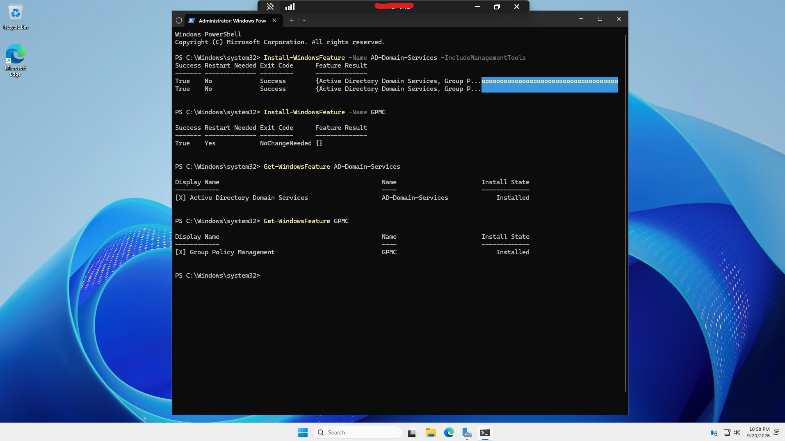

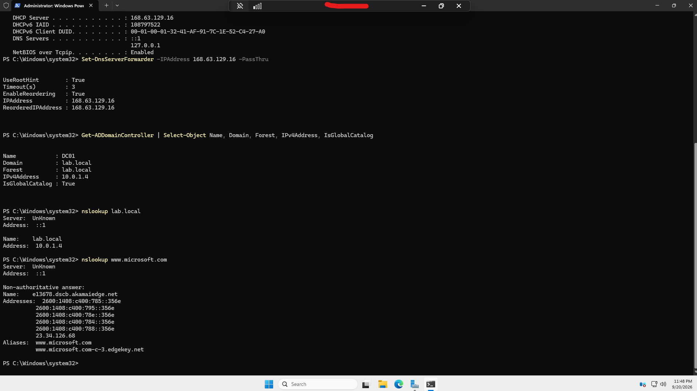

### 3. Configured DNS for the domain

Once DC01 became the DNS server for `lab.local`, the other machine in the VNet needed to use it for domain discovery. I configured the Azure virtual network to use `10.0.1.4` for DNS and configured DC01 to forward external DNS requests to Azure's resolver.

```powershell
Set-DnsServerForwarder -IPAddress 168.63.129.16 -PassThru

Get-ADDomainController |
    Select-Object Name, Domain, Forest, IPv4Address, IsGlobalCatalog

nslookup lab.local
nslookup www.microsoft.com
```

That allowed DC01 to answer authoritatively for the lab domain while still resolving public names.

### 4. Built the OU, user, and security-group structure

I created department OUs for IT, Finance, HR, and Sales, plus an OU for workstation objects. Each department received a security group, and each test user was placed in the correct OU and group.

The model was intentionally group-based: access and policy should be assigned to roles/groups whenever possible rather than directly to individual users.

A representative example:

```powershell
New-ADOrganizationalUnit -Name "IT" -Path "DC=lab,DC=local"

New-ADGroup `
    -Name "IT_Admins" `
    -GroupScope Global `
    -GroupCategory Security `
    -Path "OU=IT,DC=lab,DC=local"

Add-ADGroupMember -Identity "IT_Admins" -Members "alice.chen"
```

The complete build is saved in:

- `scripts/03-create-ou-structure.ps1`
- `scripts/04-create-users-and-groups.ps1`

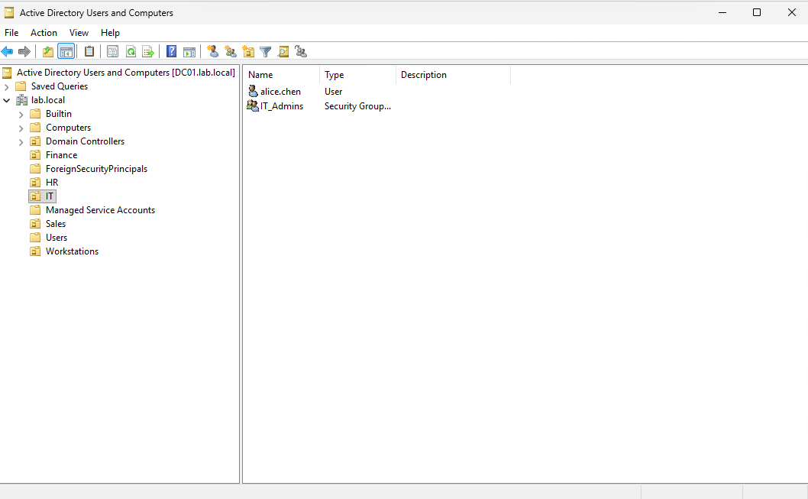

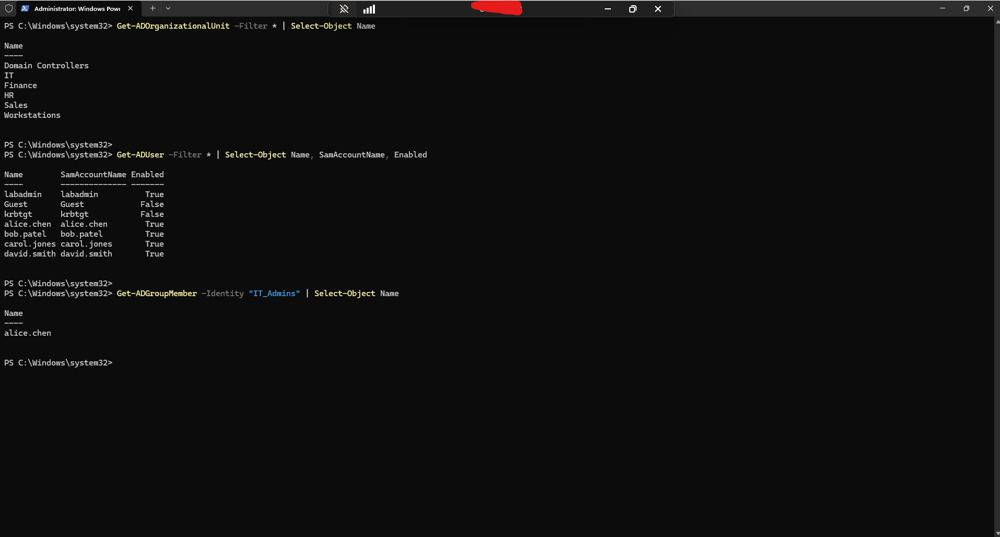

### 5. Configured Group Policy and password policy

I created an `IT Security Policy` GPO and linked it to the IT OU. The final machine settings were:

- **Interactive logon: Machine inactivity limit** — `900` seconds
- **All Removable Storage classes: Deny all access** — Enabled

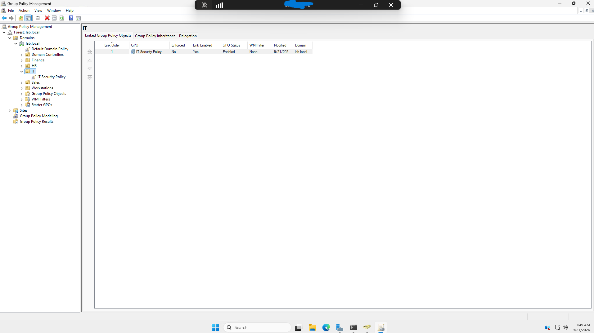

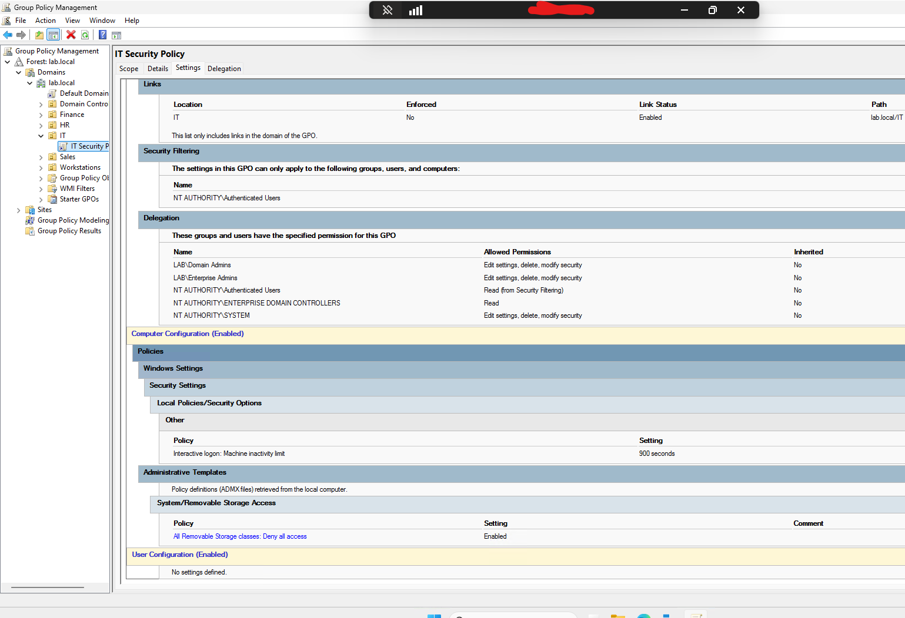

The source lab originally treated password requirements as though an OU-linked GPO would enforce them on the domain users inside that OU. I corrected that design instead of documenting a policy that only looked correct.

For stricter password requirements on the IT administrator group, I created a Fine-Grained Password Policy named `IT-Admins-PSO` and applied it to `IT_Admins`.

```powershell
New-ADFineGrainedPasswordPolicy `
    -Name "IT-Admins-PSO" `
    -Precedence 10 `
    -MinPasswordLength 12 `
    -ComplexityEnabled $true `
    -PasswordHistoryCount 24 `
    -MinPasswordAge 0.00:00:00 `
    -MaxPasswordAge 90.00:00:00 `
    -LockoutThreshold 5 `
    -LockoutDuration 00:15:00 `
    -LockoutObservationWindow 00:15:00

Add-ADFineGrainedPasswordPolicySubject `
    -Identity "IT-Admins-PSO" `
    -Subjects "IT_Admins"
```

I verified the resultant policy rather than just confirming that the PSO object existed:

```powershell
Get-ADUserResultantPasswordPolicy -Identity alice.chen
```

The result showed `IT-Admins-PSO`, a 12-character minimum, complexity enabled, password history of 24, and the configured lockout values.

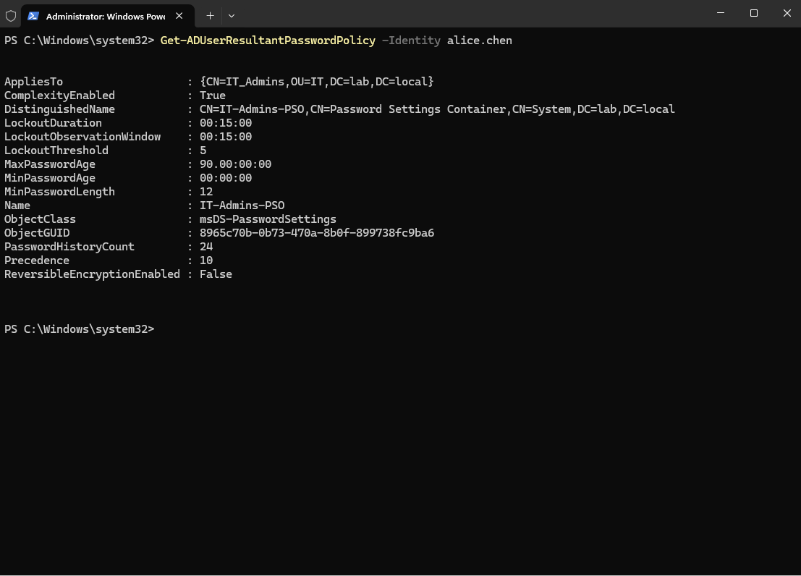

I also configured the domain-wide lockout policy with a threshold of five failed attempts and a 15-minute duration/observation window.

### 6. Built and domain-joined WS01

The lab needed a second machine to prove that policy actually reached a domain member, so I deployed `WS01` on the same VNet with private address `10.0.1.5` and no public IP.

I reached WS01 from inside DC01, verified that it was using `10.0.1.4` for DNS, and joined it to the domain.

```powershell
Add-Computer `
    -DomainName "lab.local" `
    -Credential (Get-Credential "LAB\labadmin") `
    -Restart
```

The `IT Security Policy` contains **Computer Configuration** settings, so the user signing in is not enough to make the GPO apply. I moved the WS01 computer object into the IT OU:

```powershell
Get-ADComputer -Identity "WS01" |
    Move-ADObject -TargetPath "OU=IT,DC=lab,DC=local"
```

Then I updated and inspected policy from WS01:

```powershell
gpupdate /force
gpresult /scope computer /r

Get-ItemProperty `
    'HKLM:\SOFTWARE\Microsoft\Windows\CurrentVersion\Policies\System' `
    -Name InactivityTimeoutSecs |
    Select-Object InactivityTimeoutSecs

Get-ItemProperty `
    'HKLM:\SOFTWARE\Policies\Microsoft\Windows\RemovableStorageDevices' `
    -Name Deny_All |
    Select-Object Deny_All
```

The final registry evidence showed:

```text
InactivityTimeoutSecs : 900
Deny_All              : 1
```

and `gpresult` showed `IT Security Policy` under the applied computer GPOs.

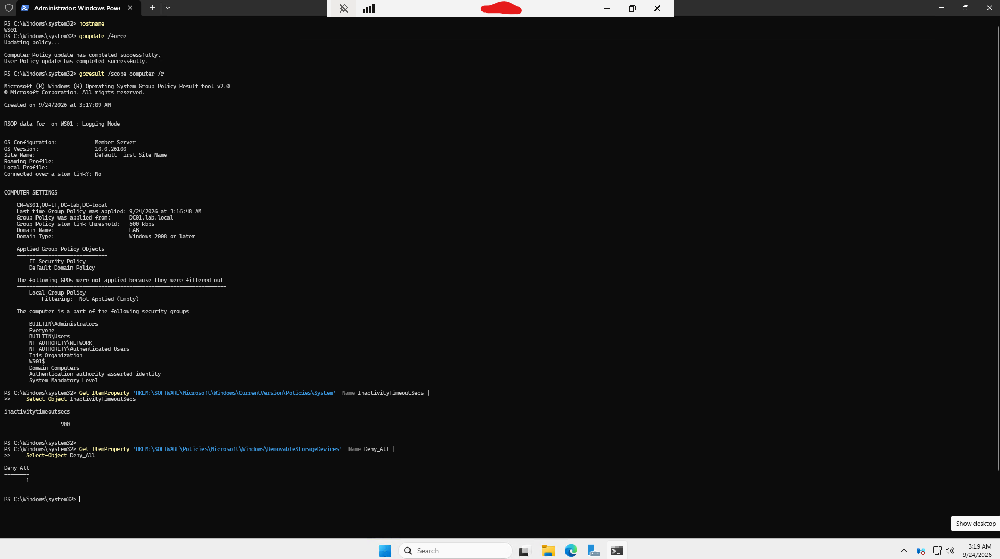

### 7. Ran common help desk identity tasks

I finished the operational portion of the lab by performing several tasks that map directly to normal Windows support work:

- reset `bob.patel`'s password and forced a password change at next sign-in;
- generated a real lockout for `carol.jones`, found the locked account, and unlocked it;
- disabled `david.smith` as an offboarding action;
- searched for disabled and inactive users;
- checked group membership for `alice.chen`.

For the password reset, the repository script should never contain a real reusable credential. A safe pattern is:

```powershell
$newPassword = Read-Host "Enter temporary password" -AsSecureString

Set-ADAccountPassword `
    -Identity "bob.patel" `
    -Reset `
    -NewPassword $newPassword

Set-ADUser `
    -Identity "bob.patel" `
    -ChangePasswordAtLogon $true
```

For the lockout workflow:

```powershell
Search-ADAccount -LockedOut |
    Select-Object Name, SamAccountName, LastLogonDate

Unlock-ADAccount -Identity "carol.jones"

Get-ADUser `
    -Identity "carol.jones" `
    -Properties LockedOut |
    Select-Object Name, LockedOut
```

The final check returned `LockedOut : False`.

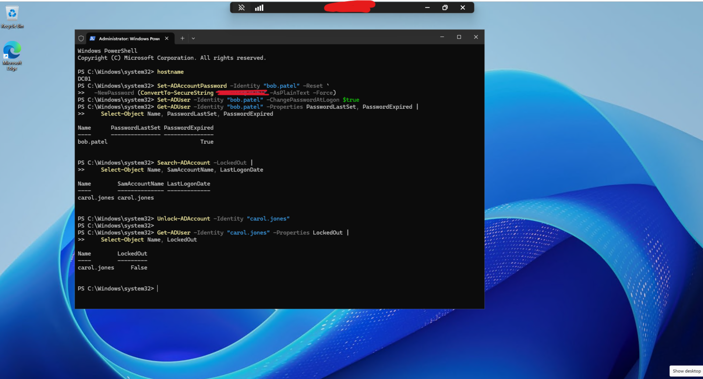

---

## Supporting validation evidence

The twelve numbered screenshots are the main recruiter-facing story. I kept additional technical proof in `screenshots/supporting/` so I could preserve evidence without cluttering the main sequence.

<details>
<summary>Open supporting screenshots</summary>

### Domain lockout policy

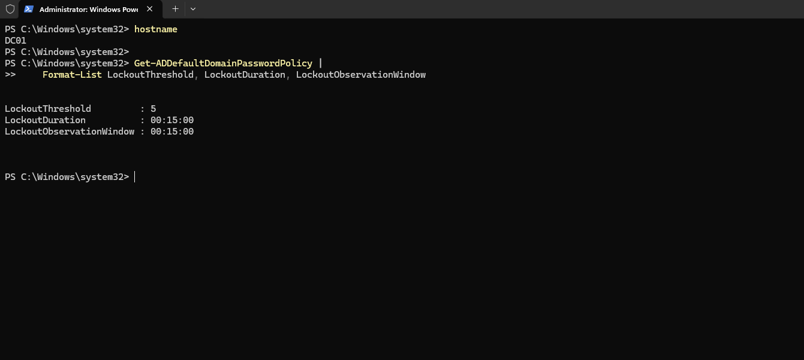

### WS01 DNS configuration

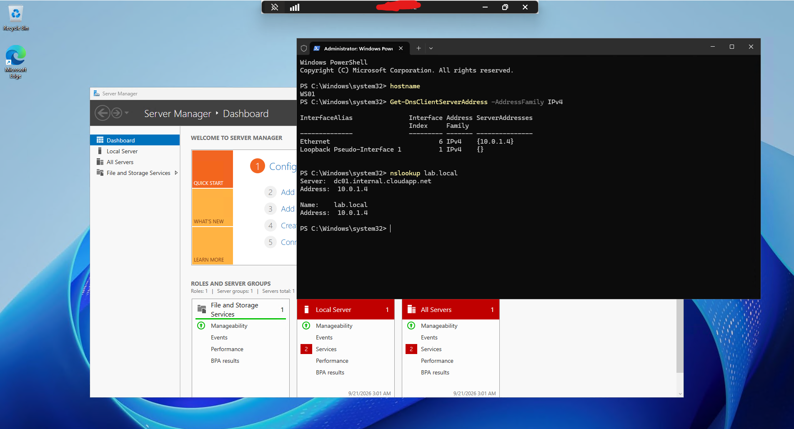

### WS01 domain membership

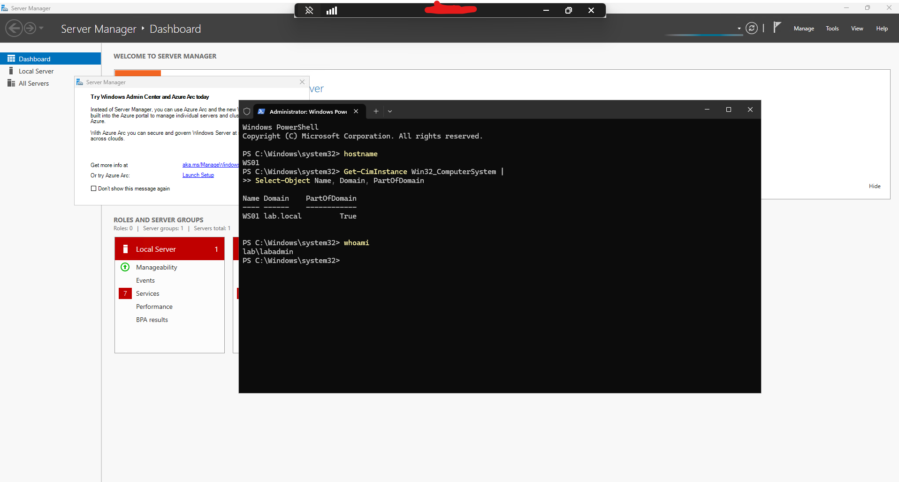

### WS01 computer object moved into the IT OU

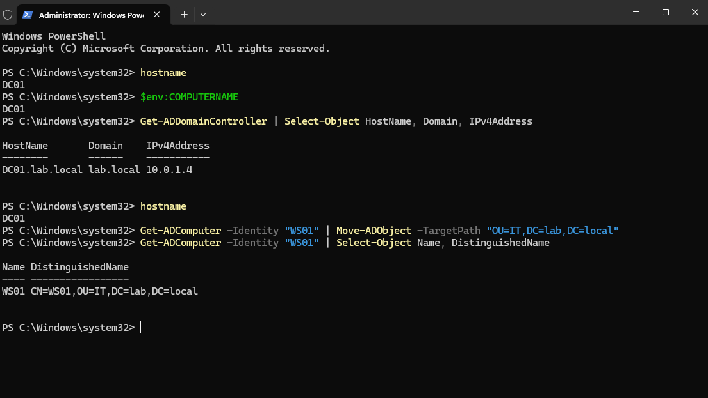

</details>

Older or duplicate evidence is kept locally in `screenshots/archive/`, which is excluded from Git so the public repository stays clean.

---

## Engineering decisions

| Decision | Why I made it |
|---|---|
| Restricted DC01 RDP to my source IP | Reduced unnecessary exposure of TCP/3389 instead of leaving it open to the internet |
| Gave WS01 no public IP | Forced administration through the internal network instead of exposing another VM |
| Kept machine policy in an OU-linked GPO | Inactivity and removable-storage controls are computer settings and should follow the computer object |
| Used a Fine-Grained Password Policy for `IT_Admins` | Per-group domain password rules need a PSO; an OU-linked password policy does not provide the intended result for domain users |
| Kept domain-wide lockout policy at the domain level | Account lockout is a domain account policy, not a workstation-OU setting |
| Prompted for sensitive passwords instead of hard-coding them | Prevented recovery/admin secrets from being committed to Git or exposed in PowerShell history |
| Used groups instead of assigning access directly to users | Kept the design consistent with role-based access control and made membership easier to manage |
| Verified effective state with `gpresult`, registry values, and resultant policy commands | Configuration objects existing is not proof that the intended computer or user received them |

---

## Corrections and improvements I made to the source lab

One of the strongest parts of this project was identifying places where following the source instructions literally would produce an incomplete or misleading result.

| Source instruction / assumption | What I observed | What I implemented |
|---|---|---|
| Password length and complexity were treated as an OU-linked GPO control for IT domain users | Domain account password policy is not scoped to users that way | Created `IT-Admins-PSO` and applied it to `IT_Admins` |
| The lab expected a second machine for policy testing without fully accounting for its build and network path | Policy needed a real domain member to validate | Built WS01 on the same VNet with no public IP |
| The second VM needed to find `lab.local` | Azure's default DNS does not host the private AD zone | Pointed VNet DNS at DC01 and configured a DNS forwarder on DC01 |
| The lab's troubleshooting advice was to set a static IP inside Windows | On an Azure VM, a hard-coded guest IP can cut the VM off the network; Azure assigns addresses through DHCP | Set DC01's private IP to Static on the Azure NIC and left Windows on DHCP |
| Signing in as `alice.chen` was required to demonstrate policy | Domain users did not automatically have RDP rights to the member server | Added the `IT_Admins` group to WS01's local `Remote Desktop Users` group |
| Computer policy appeared configured but would not follow WS01 while it remained outside the linked OU | Computer Configuration follows the computer object's OU scope | Moved `WS01` into `OU=IT` and ran `gpupdate /force` |
| A recovery password could have been embedded in the domain-promotion command | That would expose a sensitive credential in history or Git | Used `Read-Host -AsSecureString` |
| Verification counts implied only the OUs/users I manually created would exist | AD also contains built-in objects such as `Domain Controllers`, `Guest`, and `krbtgt` | Treated the extra built-in objects as expected instead of errors |
| The OU list included an OU named `Computers` | Creating it at the domain root failed because the built-in `Computers` container already uses that name | Created `OU=Workstations` instead and used that name for the rest of the build |

---

## Verification

I finished the lab with `scripts/07-verification.ps1`, which checked the environment from the command line.

The verification covered:

- DC01 as the domain controller for `lab.local`;
- the OU structure;
- user account state;
- `alice.chen` membership in `IT_Admins`;
- the `IT Security Policy` link on the IT OU;
- the resultant `IT-Admins-PSO`;
- the domain lockout threshold and duration.

Representative final output:

```text
=== DOMAIN CONTROLLER ===
Name  Domain     Forest     IPv4Address
----  ------     ------     -----------
DC01  lab.local  lab.local  10.0.1.4

=== ORGANIZATIONAL UNITS ===
Domain Controllers
IT
Finance
HR
Sales
Workstations

=== USERS ===
labadmin
Guest
krbtgt
alice.chen
bob.patel
carol.jones
david.smith

=== IT_ADMINS MEMBERS ===
alice.chen

=== GPO LINK ===
DisplayName         Enabled
-----------         -------
IT Security Policy  True

=== FINE-GRAINED PASSWORD POLICY ===
Name           MinPasswordLength  ComplexityEnabled
----           -----------------  -----------------
IT-Admins-PSO  12                 True

=== DOMAIN LOCKOUT POLICY ===
LockoutThreshold  LockoutDuration
----------------  ---------------
5                 00:15:00
```

`david.smith` appears disabled in the final user-state verification because disabling the account was part of the offboarding task.

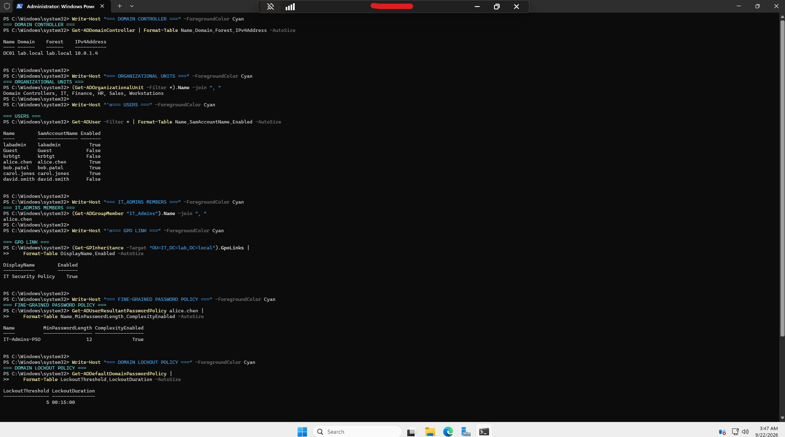

---

## Help desk playbook

| Task | Command / approach |
|---|---|
| Reset a password | `Set-ADAccountPassword -Identity "user" -Reset -NewPassword (Read-Host -AsSecureString)` |
| Force password change at next sign-in | `Set-ADUser -Identity "user" -ChangePasswordAtLogon $true` |
| Find locked accounts | `Search-ADAccount -LockedOut` |
| Unlock an account | `Unlock-ADAccount -Identity "user"` |
| Disable an account for offboarding | `Disable-ADAccount -Identity "user"` |
| Find disabled users | `Search-ADAccount -AccountDisabled -UsersOnly` |
| Find inactive users | `Search-ADAccount -AccountInactive -UsersOnly -TimeSpan 90.00:00:00` |
| Check group membership | `Get-ADPrincipalGroupMembership -Identity "user" \| Select-Object Name` |

A help desk password reset should create only a temporary credential and force the user to choose their own password. For offboarding, I disabled the account rather than deleting it so the identity, group relationships, and audit context were preserved.

---

## What broke and how I fixed it

### The planned VM size could not be deployed

`Standard_B2s` was unavailable to my subscription in East US (`NotAvailableForSubscription`). I moved to East US 2 and tried `Standard_B2ls_v2`, which failed validation because the Bsv2 family had a vCPU quota of 0 there, and my quota increase request was automatically denied.

Instead of guessing at more sizes, I opened **Usage + quotas** for East US 2 and found the Standard DSv3 family at 0 of 10 vCPUs used, with the regional vCPU total also clear. I rebuilt DC01 as `Standard_D2s_v3` and kept every lab resource in East US 2. The failed deployment had already created `rg-lab-ad`, so I reused it instead of creating a duplicate.

**What I learned:** a VM size can be blocked by regional availability, subscription restrictions, or per-family vCPU quota even when there is budget to spare. Checking quotas first turns trial and error into one decision.

### Domain controller promotion was blocked by a pending restart

The first promotion attempt stopped with _"Role change is in progress or this computer needs to be restarted."_ The GPMC install had returned `Restart Needed: Yes`, and promotion will not run while a restart is pending.

After restarting, Server Manager showed **Roles: 0**, which looked like the AD DS install had been lost. Before reinstalling anything, I checked with `Get-WindowsFeature AD-Domain-Services, GPMC`; both still showed `[X] Installed`, so the dashboard tile was just stale. I re-ran the wizard, chose **Add a new forest**, and promotion completed.

**What I learned:** check the restart flag in install output before moving to the next step, and when a dashboard looks wrong, confirm the real state from the command line before redoing any work.

### The domain-join credential step did not behave as expected

When I first attempted to join WS01 with an inline `Get-Credential` call, the credential object came back null and `Add-Computer` could not continue.

I separated the troubleshooting from the domain-join command, verified DNS and the target domain first, then retried the join with the correct domain administrator credentials. After the restart, WS01 reported `PartOfDomain : True` for `lab.local`.

**What I learned:** when a compound command fails, break it into smaller checks so I can identify whether the problem is credentials, DNS, connectivity, or the join itself.

### Policy verification failed when I checked the wrong machine

At one point I ran the registry checks on DC01. The policy values were not present there because the GPO was linked to the IT OU for the WS01 computer object.

I returned to WS01, ran `gpupdate /force`, confirmed the GPO in `gpresult`, and then queried the registry on WS01. The final values were `900` seconds for the inactivity limit and `1` for removable-storage denial.

**What I learned:** Group Policy troubleshooting starts with scope. I need to verify the correct computer/user, the object's OU, the GPO link, policy refresh, and finally the effective state.

### Nested RDP made session navigation confusing

WS01 was intentionally reached through DC01, which created an RDP-inside-RDP session. Normal shortcut behavior was not always obvious, so I used `tsdiscon` when I needed to disconnect the inner WS01 session and return cleanly to DC01.

**What I learned:** jump-box administration changes how session controls behave, and knowing how to disconnect a specific Windows session cleanly is useful operational knowledge.

---

## PowerShell automation

| Script | Purpose |
|---|---|
| `scripts/01-install-roles.ps1` | Installs AD DS and required management tools |
| `scripts/02-promote-domain-controller.ps1` | Promotes DC01 and creates the `lab.local` forest |
| `scripts/03-create-ou-structure.ps1` | Creates the organizational-unit structure |
| `scripts/04-create-users-and-groups.ps1` | Creates lab users, security groups, and memberships |
| `scripts/05-password-policy-fgpp.ps1` | Creates and assigns `IT-Admins-PSO` and verifies the resultant policy |
| `scripts/06-helpdesk-tasks.ps1` | Documents repeatable identity/help desk operations |
| `scripts/07-verification.ps1` | Produces a final state check for the domain, OUs, users, groups, GPO, PSO, and lockout policy |

---

## Security and cost controls

I treated the lab like infrastructure that could accidentally become public if I was careless.

- Restricted RDP to my current source IP rather than `Any`.
- Kept WS01 off the public internet.
- Redacted public IP and subscription information from screenshots.
- Kept DSRM/admin credentials out of PowerShell scripts.
- Used `.gitignore` to exclude:
  - `lab-values.txt`
  - `*.rdp`
  - `*.pem`
  - `*.log`
  - `.vscode/`
  - `screenshots/archive/`
- Stopped/deallocated Azure VMs between working sessions instead of only shutting down Windows.
- Used auto-shutdown as a backup control against leaving a VM running unintentionally.
- Preserved DC01 for later labs that depend on the domain while treating WS01 as disposable validation infrastructure.

**Cost controls:** VMs were stopped/deallocated between lab sessions, with Azure auto-shutdown configured as a backup control.

---

## Repository structure

```text
active-directory-domain-lab/
├── README.md
├── .gitignore
├── screenshots/
│   ├── 01-azure-vm-overview.png
│   ├── 02-nsg-rdp-restricted.png
│   ├── 03-adds-role-installed.png
│   ├── 04-domain-controller-verified.png
│   ├── 05-aduc-ou-structure.png
│   ├── 06-users-and-groups-created.png
│   ├── 07-gpo-linked-to-it-ou.png
│   ├── 08-gpo-settings-report.png
│   ├── 09-fgpp-resultant-policy.png
│   ├── 10-ws01-gpresult.png
│   ├── 11-lockout-and-unlock.png
│   ├── 12-final-verification.png
│   ├── supporting/
│   │   ├── 09a-domain-lockout-policy-verified.png
│   │   ├── 10a-ws01-dns-verified.png
│   │   ├── 10b-ws01-domain-join-verified.png
│   │   └── 10c-ws01-moved-to-it-ou.png
│   └── archive/                    # excluded from Git
└── scripts/
    ├── 01-install-roles.ps1
    ├── 02-promote-domain-controller.ps1
    ├── 03-create-ou-structure.ps1
    ├── 04-create-users-and-groups.ps1
    ├── 05-password-policy-fgpp.ps1
    ├── 06-helpdesk-tasks.ps1
    └── 07-verification.ps1
```

---

## Lessons learned / production improvements

This lab intentionally used a small single-domain-controller environment, which is appropriate for a portfolio build but not a production design.

In a production environment I would improve it by:

- using a routable namespace based on an organization-owned DNS domain rather than `.local`;
- deploying redundant domain controllers and DNS rather than relying on one server;
- using Azure Bastion, VPN, or just-in-time access instead of exposing RDP directly;
- applying least-privilege administration rather than using a high-privilege account for routine work;
- adding centralized logging, monitoring, backups, and tested recovery procedures;
- automating more of the Azure resource deployment with infrastructure as code.

---


